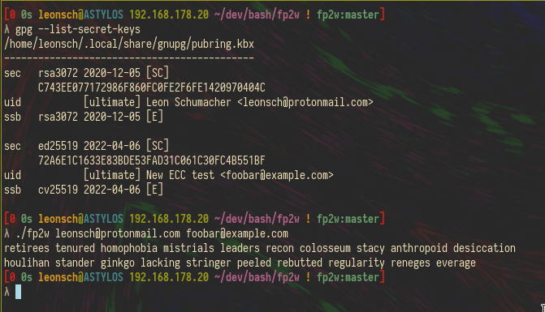

# fp2w
Tired of reading & comparing 40 hex digits just to get some digital security?
This tool could help you!

## Dependencies
- gnupg
- bc
- sed, coreutils (you should probably have these already)

## Usage
```bash
./fp2w <your@email.xyz> [other emails...]
```


## Thanks
https://www.keithv.com/software/wlist for the wordlist
